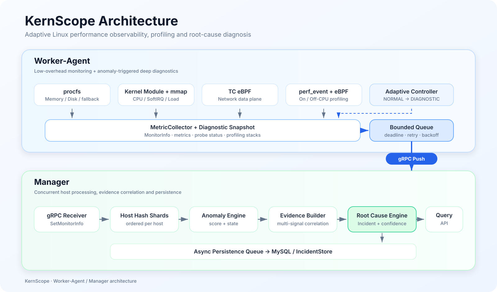
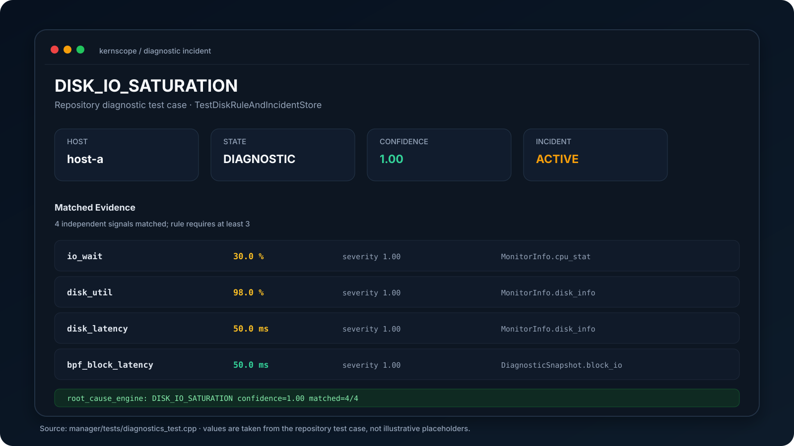

# KernScope

<p align="center">
  <b>eBPF 驱动的 Linux 内核性能观测与异常诊断系统</b>
</p>

<p align="center">
  
  
  
  
  
</p>

KernScope 是一个基于 **Worker + Manager** 架构的 Linux 性能观测与异常诊断系统。

Worker 通过 **procfs、Kernel Module、mmap、TC eBPF、perf_event** 等机制采集系统运行数据；当检测到性能异常后，动态提高采样频率并启用深度诊断能力。Manager 负责指标分析、异常检测、证据关联、根因分析和数据持久化。

```text id="vjylr3"
Monitoring
    ↓
Anomaly Detection
    ↓
Adaptive Observability
    ↓
Kernel Diagnostics / Profiling
    ↓
Evidence Correlation
    ↓
Root Cause
```

---

## Features

* **自适应观测**：根据异常状态动态调整采样周期，并按需启停深度诊断 Probe
* **Kernel Module + mmap**：采集 CPU、SoftIRQ 等内核运行指标
* **TC eBPF 网络观测**：基于 Per-CPU Hash Map 统计 RX/TX 字节、报文和速率
* **On-CPU Profiling**：基于 perf_event + eBPF 采样定位 CPU 热点调用栈
* **Off-CPU Profiling**：基于调度事件分析线程阻塞、睡眠和等待路径
* **Root Cause Analysis**：关联 CPU、Load、I/O、SoftIRQ、网络及 Profiling 证据生成诊断 Incident
* **Manager 并发处理**：按 Host 哈希分片并行消费，并通过独立持久化线程解耦 MySQL I/O
* **可靠发送**：支持有界队列、RPC Deadline、有限重试、指数退避和优雅退出
* **运行时降级**：eBPF 不可用时自动回退到 procfs 基础采集

---
## Architecture

<p align="center">
  
</p>

---

## Diagnostic Result

下面展示 KernScope 诊断链路的实际测试结果。系统关联 **IOWait、磁盘利用率、磁盘延迟及 eBPF Block I/O 延迟**等证据，最终识别为 `DISK_IO_SATURATION`。

<p align="center">
  
</p>


## Architecture

```text id="05sfse"
┌──────────────────────── Worker-Agent ────────────────────────┐
│                                                             │
│  procfs    Kernel Module    TC eBPF    perf_event / eBPF    │
│     │            │             │               │             │
│     └────────────┴─────────────┴───────────────┘             │
│                            │                                │
│                     MetricCollector                         │
│                            │                                │
│                       MonitorInfo                           │
│                            │                                │
│                      Bounded Queue                          │
│                            │                                │
│                      gRPC Push                              │
└────────────────────────────┼────────────────────────────────┘
                             │
                             ▼
┌────────────────────────── Manager ───────────────────────────┐
│                                                             │
│                       gRPC Receiver                          │
│                            │                                │
│                    Host Hash Sharding                       │
│                            │                                │
│                Anomaly / Score Engine                       │
│                            │                                │
│                 Evidence Builder + RCA                      │
│                            │                                │
│                  Persistence Queue                          │
│                            │                                │
│                MySQL / Incident Store                       │
│                            │                                │
│                      QueryService                           │
└─────────────────────────────────────────────────────────────┘
```

---

## Adaptive Diagnostics

Worker 常态保持低频采样：

```text id="72jj7w"
NORMAL
  ↓
SUSPECT
  ↓
DIAGNOSTIC
  ↓
DEEP_DIAGNOSTIC
  ↓
COOLDOWN
```

发生异常后动态：

```text id="v2zyv5"
10s Sampling
     ↓
Anomaly Detected
     ↓
1s Burst Sampling
     ↓
Enable Diagnostic Probe
     ↓
Profiling / Evidence
     ↓
Root Cause
```

---

## Kernel Observability

| 指标      | 数据来源                            |
| ------- | ------------------------------- |
| CPU     | Kernel Module + mmap / procfs   |
| Load    | Kernel Module / `/proc/loadavg` |
| SoftIRQ | Kernel Module + mmap / procfs   |
| Memory  | `/proc/meminfo`                 |
| Disk    | `/proc/diskstats`               |
| Network | TC eBPF / `/proc/net/dev`       |
| On-CPU  | perf_event + eBPF               |
| Off-CPU | sched events + eBPF             |

---

## TC eBPF Network Monitoring

KernScope 在网卡 **TC ingress / egress** 挂载 eBPF 程序，根据：

```cpp id="xh6sdk"
skb->ifindex
skb->len
```

统计：

```text id="yxmftv"
RX bytes
TX bytes
RX packets
TX packets
```

使用：

```text id="289k5m"
BPF_MAP_TYPE_PERCPU_HASH
```

让不同 CPU 独立更新统计值，用户态统一聚合，降低高 PPS 下共享热点计数竞争。

eBPF 初始化或运行时读取失败时自动回退：

```text id="jju25q"
/proc/net/dev
```

---

## Profiling

### On-CPU

```text id="6xzyb3"
perf_event
    ↓
eBPF Stack Sampling
    ↓
Stack Aggregation
    ↓
Symbol Resolution
    ↓
Hot Functions
```

用于定位 CPU 时间主要消耗在哪些线程和函数。

### Off-CPU

基于调度事件统计线程离开 CPU 后的等待时间和调用栈，用于区分：

* 锁竞争
* 睡眠等待
* I/O 阻塞
* 调度等待

---

## Root Cause Analysis

Manager 将不同观测信号构造成 Evidence，例如：

```text id="f20gj8"
CPU Usage ↑
Run Queue ↑
On-CPU Hotspot
IOWait Normal
        ↓
CPU Saturation
```

```text id="z9hwo5"
Load ↑
IOWait ↑
Disk Latency ↑
Disk Util ↑
        ↓
Disk I/O Bottleneck
```

诊断结果以 Incident 形式保存：

```text id="w2z7rx"
Incident

Severity: HIGH

Root Cause:
Disk I/O Saturation

Confidence:
0.87

Evidence:
nvme0n1 util = 98%
read latency = 47ms
iowait = 31%
```

---

## Performance

### TC eBPF

受控 veth 高吞吐测试中最高覆盖：

```text id="sf8l1f"
87.11 Gb/s
24.82 万 packets/s
```

3 轮测试中，eBPF 聚合结果与 `/proc/net/dev` 的 RX/TX 字节增量保持一致。

### Manager

Manager 从全局串行处理优化为：

```text id="q2byld"
Host Hash Sharding
+
Bounded Queue
+
Async Persistence
```

100 Host 同负载 A/B：

```text id="bz1mu3"
Legacy   78.698 s
Sharded  69.490 s

Total Time       ↓ 11.7%
Persistence Rate ↑ 1.13×
```

75 Host、1 秒上报周期、10 分钟稳定性测试：

```text id="rm8u21"
Accepted   45,000
Processed  45,000
Persisted  45,000

Queue Full          0
Persistence Reject  0
```

---

## Query API

Manager 提供以下查询接口：

| API                  | 功能         |
| -------------------- | ---------- |
| `QueryPerformance`   | 历史性能       |
| `QueryTrend`         | 指标趋势       |
| `QueryAnomaly`       | 异常数据       |
| `QueryScoreRank`     | 节点评分       |
| `QueryLatestScore`   | 最新状态       |
| `QueryNetDetail`     | 网络详情       |
| `QueryDiskDetail`    | 磁盘详情       |
| `QueryMemDetail`     | 内存详情       |
| `QuerySoftIrqDetail` | SoftIRQ 详情 |

诊断链路额外支持 Incident / Evidence 查询。

---

## Project Structure

```text id="ie0npg"
MonitorSystem/
├── worker/
│   ├── include/
│   ├── src/
│   │   ├── monitor/
│   │   ├── rpc/
│   │   ├── kmod/
│   │   └── ebpf/
│   └── scripts/
│
├── manager/
│   ├── include/
│   ├── src/
│   └── sql/
│
├── proto/
├── benchmark/
├── docs/
└── CMakeLists.txt
```

---

## Tech Stack

* **C++17**
* **Linux Kernel Module / mmap**
* **eBPF / libbpf / perf_event**
* **gRPC / Protocol Buffers**
* **MySQL**
* **CMake**

---

## Build

### Requirements

* Linux Kernel 5.4+
* GCC 9+ / Clang 10+
* CMake 3.10+
* gRPC
* Protocol Buffers
* libbpf
* Linux Kernel Headers
* MySQL 8.0+ *(optional)*

### Compile

```bash id="cbgqae"
git clone https://github.com/Chenyu2046/MonitorSystem.git
cd MonitorSystem

mkdir build && cd build
cmake ..
make -j$(nproc)
```

基础监控模式：

```bash id="ms7knv"
cmake .. -DENABLE_EBPF=OFF
make -j$(nproc)
```

---

## Quick Start

### Manager

```bash id="du775b"
./build/manager/manager
```

默认监听：

```text id="qcaosy"
0.0.0.0:50051
```

### Kernel Module

```bash id="eu8dl3"
sudo insmod worker/src/kmod/cpu_stat_collector.ko
sudo insmod worker/src/kmod/softirq_collector.ko
```

### Worker

```bash id="rj1nui"
sudo ./build/worker/worker <manager_ip>:50051
```

---

## MySQL

```bash id="l637sx"
export MONITOR_MYSQL_HOST=127.0.0.1
export MONITOR_MYSQL_USER=monitor
export MONITOR_MYSQL_PASSWORD='your-password'
export MONITOR_MYSQL_DATABASE=monitor_db
```

初始化：

```bash id="crh5ip"
mysql -u monitor -p monitor_db \
  < manager/sql/init_server_performance.sql
```

未启用 MySQL 时，Manager 使用内存存储提供部分回退查询能力。

---

## Roadmap

* [x] Linux 基础指标采集
* [x] Kernel Module + mmap
* [x] TC eBPF + Per-CPU Map
* [x] Adaptive Sampling
* [x] Diagnostic Probe
* [x] On-CPU Profiling
* [x] Off-CPU Profiling
* [x] Evidence / Root Cause Analysis
* [x] Incident Persistence
* [x] Host Hash Sharding
* [x] Async Persistence
* [x] gRPC Retry / Backoff / Deadline
* [ ] Local WAL
* [ ] Manager HA

---

## License

[MIT License](LICENSE)
