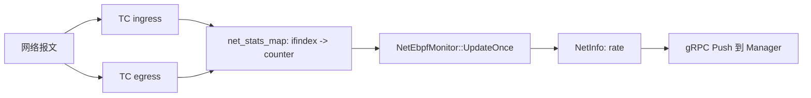
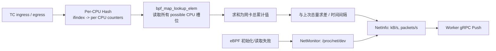

# eBPF 网络采集器 Per-CPU 聚合优化方案

## 1. 文档目的

本文定义 Worker 端 eBPF 网络采集器的下一项可交付优化：把高流量路径中的**全局原子计数**改为 **Per-CPU 计数 + 用户态周期归并**，并补齐运行时降级与可复现的性能验证。

目标不是泛化地“使用 eBPF”，而是证明监控在高 PPS（packets per second）流量下对业务网络路径的额外开销可控，同时保持指标正确、可降级、可量化。

## 实施记录（2026-07-14）

本轮已完成 Worker、Manager 和文档化单位契约的代码改造，未修改
Protobuf、gRPC 或数据库字段合同：

- `net_stats_map` 已由全局 `BPF_MAP_TYPE_HASH` 切换为 `BPF_MAP_TYPE_PERCPU_HASH`，已有 key 的计数不再使用跨 CPU 原子累加；
- `NetEbpfMonitor` 通过 `libbpf_num_possible_cpus()` 分配读取缓冲区，并在用户态归并每个 CPU 的累计值；
- eBPF 与 `/proc/net/dev` 路径均以 `delta_bytes / seconds / 1000.0` 产出
  `kB/s`；Manager 对全部接口求和后用于评分和主表落库；
- eBPF 初始化失败或连续 3 次读取 Map 失败时，Worker 会委托既有 `NetMonitor` 从 `/proc/net/dev` 继续采集；
- eBPF 正常路径额外读取 `/proc/net/dev` 的错误/丢弃累计值，避免把未采集字段误写为零；
- 带 eBPF 的 Worker 构建现在也会编入 `net_monitor.cpp`，为运行时降级提供实现。
- 手工验证程序 `worker/src/ebpf/test_net_ebpf.cpp` 已同步按 possible CPU 数分配读取缓冲区并归并统计，避免使用单个 value 读取 Per-CPU Map。

本轮静态检查已通过 `clang-format --dry-run --Werror` 与 `git diff --check`。由于当前工作机没有 CMake，也没有可用的 WSL Linux 发行版，以下验证**尚未执行**：Linux 构建、TC attach/detach、运行时降级、`iperf3` A/B/C/D 组压测和性能数据采集。任何简历数据必须以后续 Linux 实测为准。

## 2. 范围与非目标

### 2.1 本阶段范围

- 改造 `worker/src/ebpf/net_stats.bpf.c` 中按网卡统计收发字节/包数的 BPF Map；
- 改造 `worker/src/monitor/net_ebpf_monitor.cpp`，归并 Per-CPU Map 值并计算速率；
- eBPF 初始化或运行时读取失败时，真实回退到 `/proc/net/dev` 采集器；
- 统一网络速率单位为协议规定的 `kB/s`；
- 增加基准脚本/结果记录，形成可复现的优化前后数据。

### 2.2 非目标

- 不改变 gRPC/Protobuf 字段、数据库字段或查询 API；
- 不做按进程、容器、五元组或协议维度的网络归因；
- 不替换 TC 为 XDP；XDP 是另一种 Hook 位置和适用场景，不能把它当作本次优化的等价替换；
- 不承诺固定性能数字。所有结论以同一台压测机、同一流量模型下的实测结果为准。

## 3. 当前实现与问题依据

### 3.1 已有链路

当前编译条件满足时，CMake 启用 `ENABLE_EBPF`，`MetricCollector` 注册 `NetEbpfMonitor`；否则注册基于 `/proc/net/dev` 的 `NetMonitor`。



代码锚点：

- eBPF 开关与 skeleton 构建：`worker/CMakeLists.txt`；
- 采集器选择：`worker/src/monitor/metric_collector.cpp`；
- TC 程序与 Map：`worker/src/ebpf/net_stats.bpf.c`；
- 用户态读取、速率计算、TC attach/detach：`worker/src/monitor/net_ebpf_monitor.cpp`；
- `/proc/net/dev` 采集实现：`worker/src/monitor/net_monitor.cpp`；
- 协议单位：`proto/net_info.proto`，`send_rate` 与 `rcv_rate` 明确为 `kB/s`。

### 3.2 需要解决的事实问题

1. 当前 `net_stats_map` 是 `BPF_MAP_TYPE_HASH`，value 为每个网卡唯一的一份计数；已有 key 后，每个包都执行四次或两次 `__sync_fetch_and_add`。热点网卡在多核、高 PPS 场景会争用同一 cache line。
2. `NetEbpfMonitor` 初始化失败时只打印“falling back to /proc/net/dev”，但 `UpdateOnce()` 在 `loaded_ == false` 时直接返回；当前 eBPF 构建产物中并没有真实的运行时回退。
3. 历史实现将 `/1024.0` 的 KiB/s 写入标为 `kB/s` 的字段，Manager 又只
   使用首张网卡并二次换算，导致评分和主表速率不可靠。当前两条 Worker
   路径均使用 `/1000.0`，Manager 聚合所有接口且不再二次换算。
4. 现有 eBPF 路径不填充错误/丢弃计数；本阶段需明确该字段的降级来源或保持为零，不能把“未采集”误称为“无错误”。

## 4. 设计决策

### 4.1 决策：使用 `BPF_MAP_TYPE_PERCPU_HASH`

Map 的 key 保持为 `ifindex`，value 仍为四个 `u64` 累计计数，但每个在线 CPU 维护一份 value：

```text
ifindex=2
  CPU 0 -> {rx_bytes, rx_packets, tx_bytes, tx_packets}
  CPU 1 -> {rx_bytes, rx_packets, tx_bytes, tx_packets}
  ...
```

TC 程序在当前 CPU 的槽位累加，不再对跨 CPU 共享 value 做原子操作。Worker 在采集周期执行一次 `bpf_map_lookup_elem`，读取全部 possible CPU 的 value 并求和，再与上次总量计算速率。

这是本项目的最小可行改动：Hook 类型、ifindex 维度、Protobuf 合同和上报节奏都保持不变；仅替换计数数据结构与读取方式。

### 4.2 为什么不优先选择其他方案

| 方案 | 结论 | 原因 |
|---|---|---|
| Per-CPU Hash | 采用 | 保留动态网卡 key，消除报文路径的共享原子竞争。 |
| Per-CPU Array | 暂不采用 | 需要将 ifindex 映射到固定索引，网卡动态变化时管理成本更高。 |
| XDP | 暂不采用 | 需要改变 attach、兼容性和观测语义；不满足本次“最小改动”边界。 |
| 用户态轮询 `/proc/net/dev` | 保留作降级 | 易部署但缺少 TC/eBPF 采集的底层亮点，也不解决本次 eBPF 热点。 |

### 4.3 目标数据流



## 5. 实现设计

### 5.1 内核侧：Per-CPU 计数

在 `net_stats.bpf.c` 中将 Map 类型替换为 `BPF_MAP_TYPE_PERCPU_HASH`。已有 key 的更新仅更新本 CPU 的 value，因此删除 `__sync_fetch_and_add`。首次看到网卡时仍由 BPF Map 创建 key。

约束：

- 保持 `max_entries = 64`，除非基准环境证明网卡数需求超过该上限；
- 保持 `ifindex` 作为 key，避免协议改动；
- 保持 `TC_ACT_OK`，采集器不得修改、丢弃或重定向业务报文；
- 使用 `u64` 累计值；用户态以“当前值小于缓存值”为计数器重置/网卡重建处理，而不是把无符号下溢当作有效流量。

### 5.2 用户态：读取与归并

`NetEbpfMonitor` 新增“读取 Per-CPU value 并求和”的私有逻辑：

1. 启动时通过 `libbpf_num_possible_cpus()` 获取 `possible_cpus`；
2. 为一次 lookup 分配 `possible_cpus * sizeof(net_stats)` 的连续缓冲区；
3. 每次读取某个 `ifindex` 时，对全部 CPU 槽位的四项计数分别求和；
4. 缓存的仍是**归并后的总累计值**，以避免将 CPU 数变化泄漏到速率计算；
5. `delta_bytes / elapsed_seconds / 1000.0` 写入 `send_rate`/`rcv_rate`，严格匹配 `NetInfo` 的 `kB/s` 定义；包速率保持 `packets/s`。

`bpf_map_lookup_elem` 的返回缓冲区大小必须按 possible CPU 数计算；不能继续用当前单个 `net_stats` 结构读取 Per-CPU Map。

### 5.3 运行时降级

将普通 `NetMonitor` 编入带 eBPF 的 Worker，并由 `NetEbpfMonitor` 在以下情况委托调用：

- skeleton open/load 失败；
- 任一关键 TC attach 失败且未成功附加任何接口；
- Map fd 无效；
- 连续读取失败达到阈值（阈值初始建议为 3 个采样周期，并记录错误原因）。

降级要求：

- 每次降级必须有清晰日志，包含原因、接口名（如适用）和是否已切至 `/proc`；
- 同一采样周期只产出一种网络采集结果，避免 eBPF 与 `/proc` 重复写入 `net_info`；
- `Stop()` 仍负责 detach 成功附加的 TC hook；
- eBPF 恢复探测不纳入首版，避免后台重载带来额外状态机。恢复由 Worker 重启触发即可。

### 5.4 错误/丢弃字段

Per-CPU eBPF Map 仅统计字节和包数，不能凭空生成 `err_in`、`err_out`、`drop_in`、`drop_out`。首版采用：

- eBPF 正常时，额外从 `/proc/net/dev` 只读取错误/丢弃累计值；
- eBPF 降级时，由 `NetMonitor` 同时提供速率与错误/丢弃字段；
- 若读取失败，记录采集失败，不把未读取字段解释为“0 错误”。

这是一条正确性补齐，不会改变网络吞吐计数的主优化路径。

## 6. 兼容性、风险与边界

| 风险 | 影响 | 控制方式 |
|---|---|---|
| 内核/libbpf 不支持或权限不足 | eBPF 无法加载 | 保留 `/proc/net/dev` 降级，日志标识降级状态。 |
| Per-CPU Map 用户态缓冲区长度错误 | 读数错误或内存越界 | 用 `libbpf_num_possible_cpus()` 动态计算并在单测中覆盖。 |
| 网卡重建/计数器重置 | 可能出现负 delta | 检测当前累计值小于缓存值，按当前累计值重新建立基线。 |
| 采样周期过短 | 归并成本相对升高、速率波动 | 基准测试至少覆盖 1s、5s、10s 周期。 |
| TC `clsact` 生命周期 | 可能影响宿主机已有 qdisc | 记录 qdisc 所有权；首版只 detach 本程序，不盲目删除已有 qdisc。 |
| 统计口径不同 | 与 `/proc` 对账出现差异 | 明确对账窗口、接口集合与允许误差；不跨 loopback/容器接口直接比较。 |

## 7. 基准与验收方案

### 7.1 前置环境

- Linux 主机两台或一台可稳定回环压测的环境；记录 CPU 型号、核数、内核版本、NIC、MTU、`clang`/`libbpf` 版本；
- 固定 Worker 上报周期、Manager 地址、编译参数和网卡；
- 使用 `iperf3` 产生 TCP 流量；如需高 PPS，再增加 UDP 小包模型；
- 每个场景至少预热 30 秒、采样 180 秒，重复 3 次；同一场景仅改变 Map 实现。

### 7.2 对照组

| 组别 | Worker 网络采集方式 | 用途 |
|---|---|---|
| A | 不启用网络 eBPF 采集 | 业务吞吐与 CPU 的空载参考。 |
| B | 当前全局 Hash + 原子累加 | 优化前基线。 |
| C | Per-CPU Hash + 用户态归并 | 优化后候选实现。 |
| D | `/proc/net/dev` | 正确性与降级参考，不与 eBPF 的 Hook 开销作等价比较。 |

### 7.3 记录指标

1. 业务侧：`iperf3` 吞吐、重传（TCP）、丢包/抖动（UDP）；
2. Worker：进程 CPU 占用、RSS、上下文切换、采集函数 P50/P95/P99 耗时；
3. 系统侧：软中断占比、每秒包数、eBPF 程序运行次数与平均运行时间（可用 `bpftool prog show`、`perf` 或内核支持的统计信息）；
4. 正确性：同一时间窗口内 eBPF 与 `/proc/net/dev` 的累计字节差和速率差；
5. 可靠性：eBPF load/attach 失败时，Worker 是否持续输出 `/proc` 网络指标并可正常 Push。

计算：

```text
CPU 降幅 = (baseline_cpu - optimized_cpu) / baseline_cpu * 100%
吞吐影响 = (no_probe_throughput - current_throughput) / no_probe_throughput * 100%
累计字节误差 = abs(ebpf_bytes - proc_bytes) / proc_bytes * 100%
```

### 7.4 验收标准

以下数值是首轮目标和告警线，不是可提前写入简历的结果：

- C 组在高 PPS 场景的 Worker CPU 不高于 B 组，且改善应在 3 次重复中方向一致；
- C 组相对 A 组的业务吞吐影响不劣于 B 组；
- 与 `/proc/net/dev` 对账的累计字节误差在稳定接口、固定窗口内小于 1%；
- C 组采集 P99 耗时有记录，且不超过当前采样周期的 5%；
- eBPF 失败时，网络字段仍由 `/proc` 产生，Worker 不退出且 Push 链路持续可用；
- 现有 eBPF attach/detach 的资源清理验证通过，未遗留本程序的 TC filter。

若 C 组在 CPU 或吞吐上没有方向一致的改善，不把方案包装成性能优化成果；保留数据并排查流量不足、CPU 未饱和、测试噪声或用户态归并成本。

## 8. 实施顺序

1. **建立基线**：先完成 B 组与 A 组的数据采集和环境记录；
2. **内核侧改造**：替换为 Per-CPU Hash，删除热路径原子累加；
3. **用户态归并**：按 possible CPU 数读取、求和并修正为 `kB/s`；
4. **降级与字段补齐**：接入 `NetMonitor` fallback，补齐错误/丢弃统计来源；
5. **验证**：功能、对账、attach/detach、失败降级、压测；
6. **复盘**：生成实验记录，只有实测结果满足验收条件才更新 README/简历材料。

## 9. 交付物清单

- 代码改动与针对 Per-CPU 归并的测试；
- `docs/ai/` 下的压测环境和结果记录（包含原始命令、日期、配置、重复次数）；
- 优化前/后对比表与原始数据文件；
- 一段只引用实测数字的简历表述。

建议结果表：

| 场景 | 组别 | 吞吐 | Worker CPU | 采集 P99 | 字节误差 | 备注 |
|---|---:|---:|---:|---:|---:|---|
| TCP 大包 | A | 待测 | 待测 | 不适用 | 不适用 | 空载对照 |
| TCP 大包 | B | 待测 | 待测 | 待测 | 待测 | 原子 Hash |
| TCP 大包 | C | 待测 | 待测 | 待测 | 待测 | Per-CPU Hash |
| UDP 小包 | B | 待测 | 待测 | 待测 | 待测 | 高 PPS 基线 |
| UDP 小包 | C | 待测 | 待测 | 待测 | 待测 | 高 PPS 优化 |

## 10. 简历表述模板（仅在实测后填写）

> 基于 TC eBPF 实现网卡流量采集；将共享 Hash Map 原子计数改造为 Per-CPU 聚合，消除高 PPS 下多核计数竞争。在 `<硬件与流量模型>` 压测中，Worker CPU 占用由 `<A%>` 降至 `<B%>`，采集 P99 由 `<C ms>` 降至 `<D ms>`；并通过 `/proc/net/dev` 对账将累计字节误差控制在 `<E%>` 以内，eBPF 不可用时自动降级到 procfs 采集。

禁止填写未经复现的百分比、吞吐或误差数据；面试中应能给出压测工具、环境、对照组和误差口径。

## 11. 开放问题

- 当前目标部署环境的内核版本、libbpf 版本、NIC 速率和是否具备 root/CAP_BPF 权限尚未确认；
- eBPF 与 `/proc/net/dev` 对账时是否纳入容器/veth 接口，需要在压测开始前固定；
- 部署前历史 `server_performance` 行必须按本次变更时间切分：旧行只含首张
  网卡且带有二次 `/1024` 换算，不能与新的全接口 `kB/s` 聚合趋势混用；若需
  连续趋势，应从原始采集数据重算后迁移。
